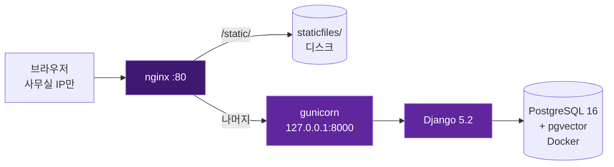
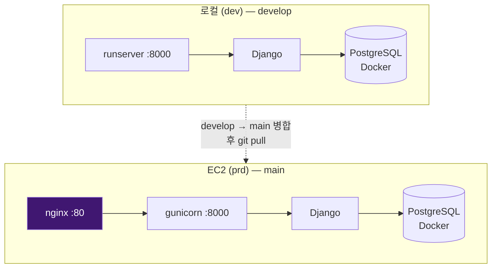
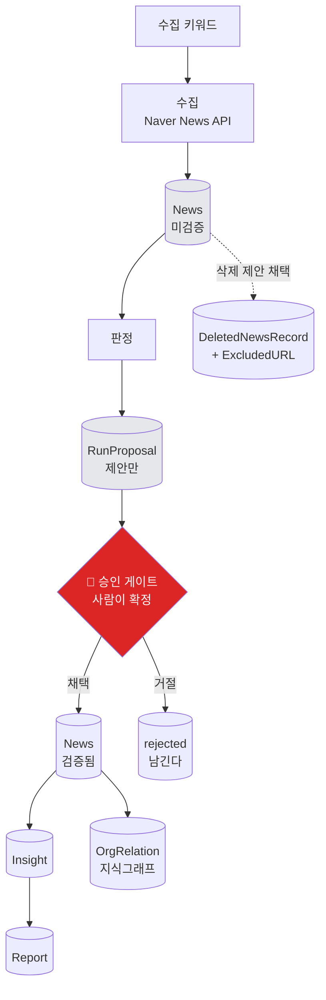
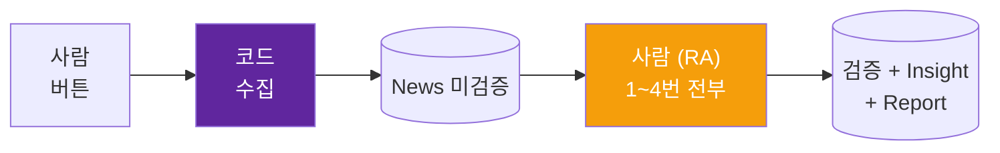
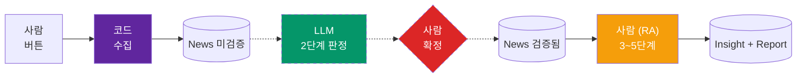
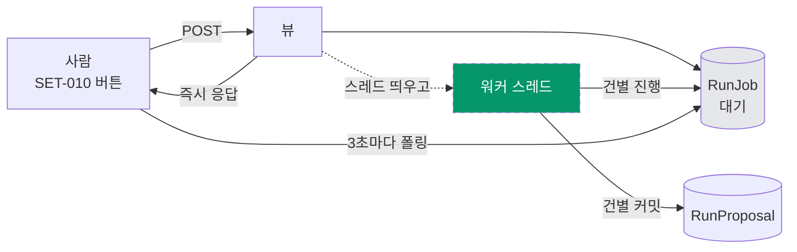
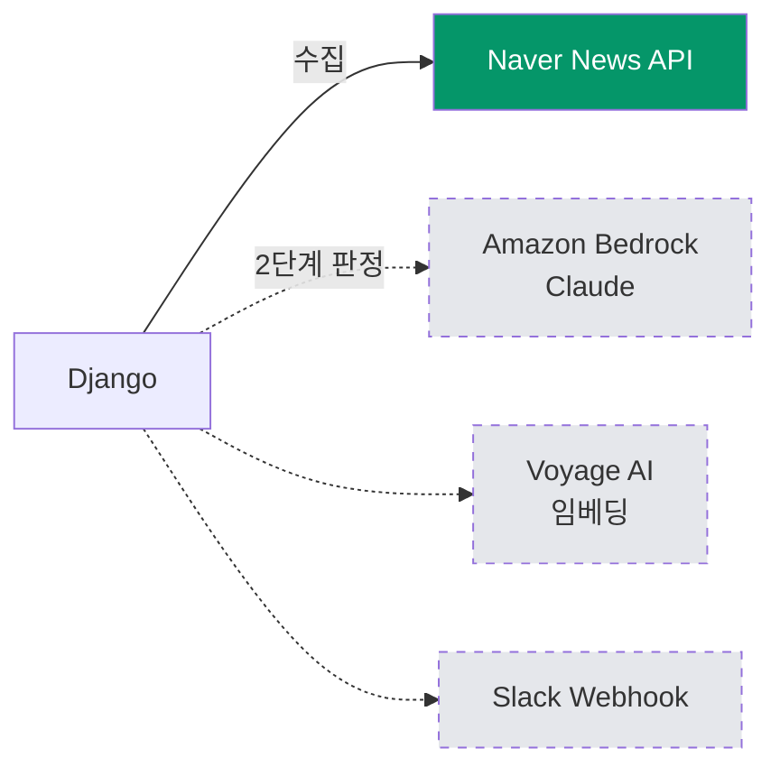

# 아키텍처

무엇이 어디에 있고 어떻게 연결되는지만 담는다. **왜 그렇게 정했는지는 `docs/planning.md`가 정본**이고 여기 옮기지 않는다. 두 문서가 같은 근거를 들면 갱신이 갈린다.

구조도가 본문이고 아래 설명은 그 그림을 읽는 법이다.

- 실선과 채움은 **지금 도는 것**, 점선과 빈 칸은 **아직 아닌 것**이다.
- 최종 갱신 2026-09-14.

---

## 1. 시스템 구성



| 층 | 맡는 일 |
|---|---|
| **nginx** | 80번을 받는다. 정적 파일을 디스크에서 바로 내려주고 나머지만 넘긴다. 느린 연결을 흡수하고 TLS 종단 자리를 갖는다 |
| **gunicorn** | 루프백만 듣는다. 바깥에서 직접 못 붙는다. `gthread` 2워커 4스레드 |
| **Django** | 서버 사이드 렌더링. 별도 API 레이어 없음. HTMX가 조각을 받아 부분 갱신 |
| **PostgreSQL** | Docker 컨테이너 하나. 앱은 호스트 venv에서 돈다 |

서버 설정의 정본은 [`deploy/`](../deploy/)다. `nginx.conf`와 systemd 유닛 모두 배포 때 복사된다.

---

## 2. 로컬과 프로덕션



| | 로컬 | EC2 |
|---|---|---|
| 브랜치 | `develop` | 🔴 `main` 만 |
| Python, 패키지 | 3.12 + `venv/`, `requirements.txt` 전량 `==` 고정 | **같음** |
| 앱 서버 | `runserver` | `gunicorn` |
| 앞단 | 없음 | nginx |
| 가동 | 항시 | 평일 08:00~19:00 자동 |

🔴 **EC2는 2026-09-11 덤프 상태로 동결돼 있다.** LLM 연동이 완료되는 시점에 한 번 갈아엎고 그 뒤로 로컬에서 EC2로 가는 방향은 영구히 닫힌다. 동결 기간에 EC2에서 **수집 버튼, 설정 변경, Slack 발송을 하지 않는다.** 근거는 `planning.md` 8-(b-1).

---

## 3. 데이터 흐름



**게이트가 두 개다. 서로 다른 것을 막는다.**

| 게이트 | 막는 것 | 어디서 |
|---|---|---|
| **검증 게이트** | 판정 안 끝난 뉴스가 화면에 나오는 것 | `News.objects.verified()` |
| **승인 게이트** | LLM 판정이 DB에 바로 반영되는 것 | 검토 화면의 확정 버튼 |

- ⚠️ **승인 게이트는 「다음 단계로 가도 되는가」가 아니다.** 그건 `can_run`과 `block_reason`이 본다. 승인 게이트는 **「이 판정을 DB에 써도 되는가」**만 묻는다.
- **확정 전까지 `News`는 미검증 그대로**라 검증 게이트가 걸려 사용자 화면에 아무것도 새지 않는다.
- 🔴 **거절된 제안을 지우지 않는다.** 프롬프트 정확도를 잴 유일한 정답지다.
- **삭제는 되돌릴 수 없다** — `ExcludedURL`이 생겨 재수집이 막힌다. 승인 게이트가 있는 이유다.

---

## 4. 역할 경계 — 코드와 LLM과 사람

### 지금



### 2단계 LLM 이후 (예정)



| SET-010 단계 | RA 번호 | 지금 | 이후 |
|---|---|---|---|
| 1단계 수집 | — | 코드 | 코드 |
| **2단계 뉴스 정리** | 1번 | 사람 (RA) | 🟢 **LLM + 사람 확정** |
| 3단계 주요 이슈 | 2번 | 사람 (RA) | 사람 (RA) |
| 4단계 주간 보고서 | 3번 | 사람 (RA) | 사람 (RA) |
| 5단계 월간 보고서 | 4번 | 사람 (RA) | 사람 (RA) |

⚠️ **이 제품의 정체가 "수집은 코드가 하고 판단은 에이전트가 한다"인데, 그 경계선이 지금 움직이는 중이다.** 2단계만 넘어가고 나머지 셋은 그대로다.

⚠️ **RA를 없애는 설계가 아니다.** LLM 판정과 RA 판정이 갈리면 **확정 버튼을 누른 사람이 이긴다.** 다만 확정되지 않은 배치에 RA를 붙이지 않아 갈릴 자리를 순서로 없앤다.

---

## 5. 실행 축 — 버튼에서 백그라운드까지



- **버튼 요청은 `RunJob`을 만들고 스레드를 띄운 뒤 즉시 반환한다.** gunicorn `--timeout 60`에 걸리지 않는다.
- 🔴 **상태는 예외 없이 `RunJob`(DB)에 쓴다.** gunicorn 워커가 여럿이라 메모리에 두면 폴링이 못 본다.
- **하트비트** — 스레드가 건별로 마지막 진행 시각을 갱신하고, **읽는 쪽이** 끊긴 지 오래된 `진행중`을 `중단됨`으로 판정한다. 감시 프로세스를 두지 않는다.
- ⚠️ **지금은 동기다.** `setting_run_start()`가 웹 요청 안에서 수집을 끝까지 돌린다. **수집도 같은 경로로 옮긴다.**

---

## 6. 외부 의존



| 서비스 | 붙는 자리 | 상태 |
|---|---|---|
| **Naver News API** | 1단계 수집 | ✅ 동작 |
| **Amazon Bedrock** | 2단계 판정 | ⬜ 자격증명과 모델 접근은 확인, **코드는 아직 없음** |
| **Voyage AI** | 임베딩 | ⬜ `services/embedder.py`는 있으나 **파이프라인이 쓰지 않음** |
| **Slack Webhook** | 보고서 발송 | ⬜ **코드 없음** |

**Bedrock 접속 값** (2026-09-14 실측 확인)

```
클라이언트   AnthropicBedrock(aws_region="ap-northeast-2")
모델        global.anthropic.claude-haiku-4-5-20251001-v1:0
캐시        cache_control={"type": "ephemeral", "ttl": "1h"}
```

- ⚠️ **`AnthropicBedrockMantle`은 서울 리전에 엔드포인트가 없다** (`bedrock-mantle.ap-northeast-2.api.aws` DNS 미존재). 표준 `AnthropicBedrock`을 쓴다.
- ⚠️ **모델 ID에 `global.` 접두사가 필수다.** 서울 리전 Anthropic 모델이 `INFERENCE_PROFILE` 전용이다.
- 🔴 **`count_tokens`가 Bedrock에서 안 된다.** 토큰을 미리 세는 코드를 짜면 안 되고 응답의 `usage`로만 알 수 있다.
- **인증은 환경 차이만 있다.** 로컬은 `.env`의 `AWS_ACCESS_KEY_ID`와 `AWS_SECRET_ACCESS_KEY`, EC2는 IAM Role이다. **코드에 분기가 없다.**

---

## 더 알아보기

- [`docs/planning.md`](./planning.md) — 제품 정책과 이 구조를 정한 근거. 「1번(뉴스 정리)을 LLM으로 옮기는 설계」 절
- [`docs/dev.md`](./dev.md) — 데이터 모델, URL 구조, 배포 절차
- [`docs/design.md`](./design.md) — 화면별 와이어프레임과 컴포넌트 스펙
- [`CLAUDE.md`](../CLAUDE.md) — 아키텍처 규칙과 화면 ID 체계
